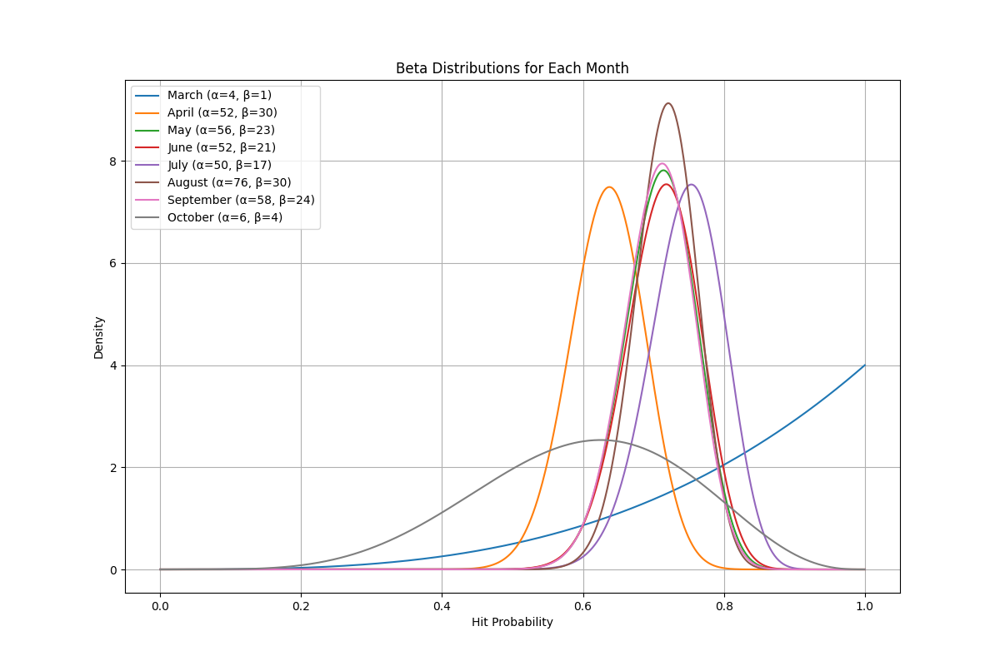
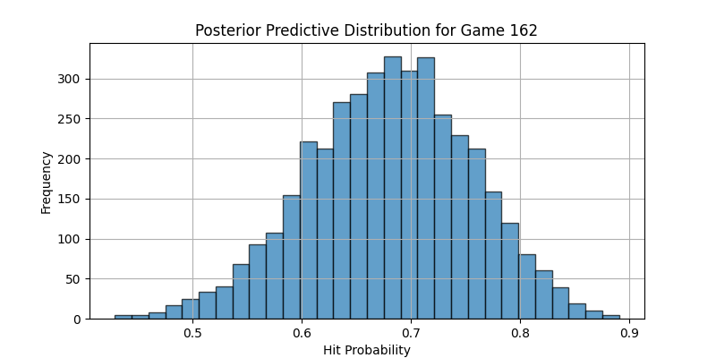

# **Predicting Corey Seager's Probability of a 20+ Game Hitting Streak in 2025**

## **Project Overview**
This project uses advanced statistical techniques, including Bayesian Modeling and Monte Carlo Simulation, to estimate the probability of Corey Seager achieving a 20+ game hitting streak in the 2025 MLB season.

## **Methodology**

### **1. Data Collection**
This analysis uses two datasets:
- **SeagerHits**: Game-by-game performance data for Corey Seager from the 2021-2024 MLB seasons.
  - Data from these seasons was chosen for its combination of relevance and sufficient sample size for NL opponents from Seager's time on the Dodgers.
- **Rangers2025Schedule**: The Texas Rangers' 2025 schedule, used for prediction.

### **2. Data Exploration**
The distribution of games in which Corey Seager achieved a hit vs. no hit is shown below:

From this data, Seager's probability of getting a hit in a randomly selected game during the 2021–2024 MLB seasons was estimated at 0.709. Therefore, we can use the following formula (via Adam Dorhauer) for the probability of at least one successful streak to calculate a baseline expectation for our model.

**1 - (1 - p^k)^N**

Where: 

- *p = probability of success*

- *k = length of streak*

- *G = number of games in a season*

- *N = estimated opportunities to begin a streak*
*= (G-k) * (1-p) + 1*

**Baseline Expectation = 1 - (1 - 0.709^20)^(162-20) * (1-0.709) + 1 = 0.0427**

### **3. Choosing Priors for the Bayesian Model**
To fit the Bayesian model, the data was split into the following categories to capture variability in Seager's hitting probability. Beta distributions were calculated for each category.

#### **A. Opponents**
Since projecting the pitchers that Corey Seager will face in each game would involve immense variability, we will split the data by the opposing teams to capture the strength of the pitching staff as a whole and Seager's historical trends against them.
The Beta distributions for Corey Seager's hit probability against each of the Rangers' AL West rivals, who Seager will be facing the most next season, are shown below.

The variability among opponents is significant, making these distributions suitable as priors.

#### **B. Months**
A 20 game hitting streak can be achieved in the span of about a month, so players that are historically perform well during a specific month of the season would have a higher probability of a hitting streak than players with similar batting averages but display little variability across the season.
The Beta distributions for Corey Seager's hit probability in each month of the MLB season are shown below.

The variability is less pronounced compared to opponents, except for the outlier months of March and October (small sample sizes). However, we will still use these distributions as priors, albeit with a lower weight than opponents.

#### **C. Home/Away Games**
The difference between home and away games can often capture differences in player performance. The Beta distributions for Corey Seager's hit probability between home and away games are shown below.

Interestingly, Corey Seager's performance in terms of achieving a hit differs very little between home and away games. Therefore, these distributions would likely have a minimal effect on informing his predicted hit probabilities for next season. 
Rather than using these distributions as priors, we will instead use it as a multiplier that only slightly affects the model's predictions.

### **4. Fitting the Bayesian Model**
We will employ a Bayesian model to estimate the probability of Corey Seager getting a hit in each game of the 2025 MLB season, considering the following priors/multipliers:
- **Opponent**: A significant factor, accounting for historical performance and competition level.
- **Month**: Accounts for seasonal streakiness.
- **Home/Away**: Adds minor adjustments for home and away games.

The posterior distributions for each game were derived by combining the priors and accounting for the multiplier, producing dynamic hit probabilities. The posterior predictive distributions for three sample games are shown below:

Based on these graphs, I am satisfied with the variability in each game's posterior predictive distributions to move onto the Monte Carlo simulation.

### **5. Accounting for Streak-related Factors**
In order to improve our Monte Carlo simulation's ability to simulate the outcome of Corey Seager's 2025 season, we will introduce additional factors that affect his probability of achieving a 20+ game hitting streak. 
First, we must consider Seager's historical hitting streak trends so I calculated the average length of his hitting streaks of more than 1 game and the longest streak that he achieved in each season.
For simplicity, we will be using the values from the 2024 season in our simulation.

**Average Length of Hitting Streak in 2024 = 4.5**

**Longest Hitting Streak in 2024 = 16**

We will be introducing a bonus, up to 2.5%, to Corey Seager's hit probabilities in games as he approaches his average hitting streak length to simulate his ability to sustain streaks of that length. We will also introduce a penalty, up to 5%, 
in games where he is on a streak that exceeds his longest hitting streak to account for the deviation from his historical maximum.

Unfortunately, Corey Seager has a sustained history of injuries that required him to miss games, which would decrease his probability of a 20 game hitting streak and should be accounted for in the simulation. The number of games that Corey Seager has played 
in each season in our dataset is shown below:

On average, Corey Seager has missed a total of 40 games per season during the 2021-2024 MLB seasons, so our simulation will randomly select 4 separate 10 game spans where Seager will be considered a DNP. This should be an optimal method to replicate a stint on the IL.
If Corey Seager is currently on a hitting streak, the games in which he is considered DNP would not break the streak, but he will also not be adding to the streak. In addition, the simulation will introduce a 10% penalty to the hit probability of Seager getting a hit for
the game immediately after a DNP stint to simulate the effect of rust after time off.

### **5. Monte Carlo Simulation**

Using posterior probabilities for each game from the Bayesian model and the features noted above, our Monte Carlo simulation will:
1. Simulate 1000 162-game seasons, checking for 20+ game hitting streaks in each.
2. Compute the probability of a 20+ game hitting streak by dividing the number of successful seasons by 1000.
3. Repeat for 10 simulation runs to derive stable probability estimates.

### **6. Results**
After running the Monte Carlo simulation, these are our results:

**Mean Probability of a 20+ Game Hitting Streak from 10 Runs of 1000 Simulated Seasons = 0.0303**

**Median Probability of a 20+ Game Hitting Streak from 10 Runs of 1000 Simulated Seasons = 0.0305**

**95% Confidence Interval for the Probability of a 20+ Game Hitting Streak: (0.0269, 0.0337)**

The mean and median probability of a 20+ game hitting streak from the Monte Carlo simulation are extremely close, so I would be comfortable using either one as my final answer. These results are considerably lower when compared to the baseline expectation, but that is
expected because the simulation accounts for external factors that is impossible for a simple probability calculation.

In addition, we can consider the distribution and cumulative probability of the longest hitting streaks across all 10000 simulated seasons.

We can see that the distribution of the longest streak lengths is centered around 10-12, which aligns with Corey Seager's historical longest streak lengths from the 2021-2024 MLB seasons. 
In addition, the distribution and cumulative probability are clearly right-tailed and showcase the steep dropoff in the probability of achieving a hitting streak when approaching extreme levels.
The longest hitting streak observed across the simulations appears to be around 34-35, which is plausible given that the longest hitting streak in the past 15 years was Dan Uggla's 31 game streak in 2011.

#### Final Result
**The probability that Corey Seager will have at least hitting streak of 20+ games in the 2025 MLB season is 0.0303 or 3.03%.** 
